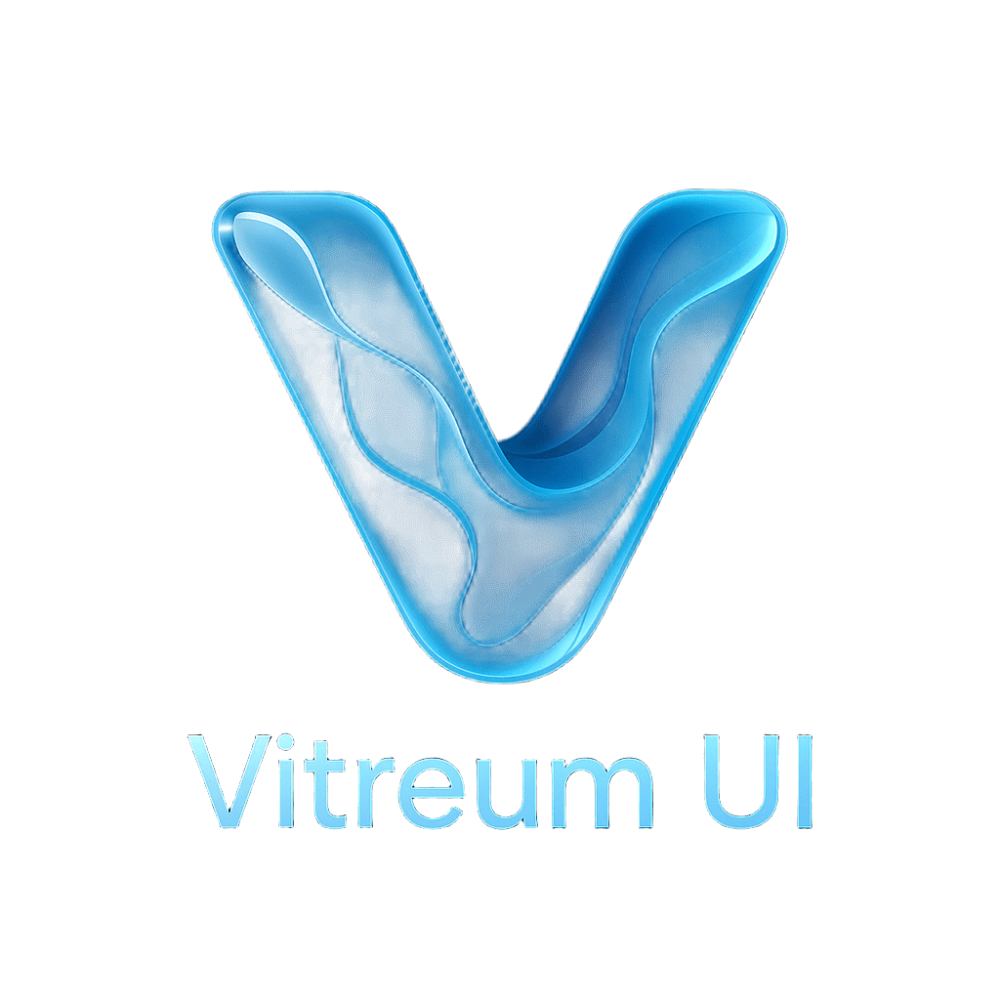

<p align="center">
  
</p>


> **Vitreum UI** — A modern CSS library to create liquid glass-inspired web interfaces, delivering true glassmorphism, dynamic lighting, and fluid interactive effects.

---

## ✨ Features

- **Translucency & Refraction**  
  Multi-layered translucency, realistic glass refraction, and specular highlights for a true glass effect.
- **Fluid Dynamics & Interaction**  
  Ripple and particle animations, fluid morphing, and real-time highlights that respond to user actions.
- **Adaptive Environment Awareness**  
  Intelligent color and opacity adjustments for both light and dark backgrounds.
- **Elevated Controls & Depth**  
  Floating, glassy controls with subtle curved shadows for enhanced spatial depth.
- **GPU/CPU Accelerated Rendering**  
  Smooth performance for complex animations and high-quality visual effects.

---

## 🚀 Quick Start

1. **Install**

   ```bash
   npm install vitreum-ui-css
   ```

2. **Import Styles**

   ```css
   @import 'vitreum-ui-css/dist/vitreum-ui.css';
   /* Or in your JS/TS entry file */
   import 'vitreum-ui-css/dist/vitreum-ui.css';
   ```

3. **Apply Class Names**

   ```html
   <div class="vt-glass vt-glass--blur vt-glass--highlight">
     <!-- Your content here -->
   </div>
   ```

   For more usage details, see the [Documentation](#documentation).

---

## 🧩 Design Philosophy

Vitreum UI brings high-fidelity, immersive glassmorphism to modern web apps.

- **Translucency & Refraction:**  
  Elements appear as real glass, supporting light bending and dynamic highlights.
- **Fluid Morphing & Animations:**  
  Controls and surfaces morph, ripple, and animate smoothly on user interaction.
- **Environment Awareness:**  
  Automatically adapts color and opacity for dark/light backgrounds and system themes.
- **Elevated Glassy Controls:**  
  Buttons, sliders, and panels float above backgrounds with subtle curvature and shadow for depth.

---

## 📚 Documentation

- [Usage Guide](docs/usage.md)
- [API Reference](docs/api.md)
- [Examples & Demos](docs/examples.md)

---

## 🛠️ Contributing

Contributions are welcome!  
Please read the [Contributing Guide](CONTRIBUTING.md) for details.

---

## 📄 License

MIT © [PageSecOnd](https://github.com/PageSecOnd/vitreum-ui-css)
