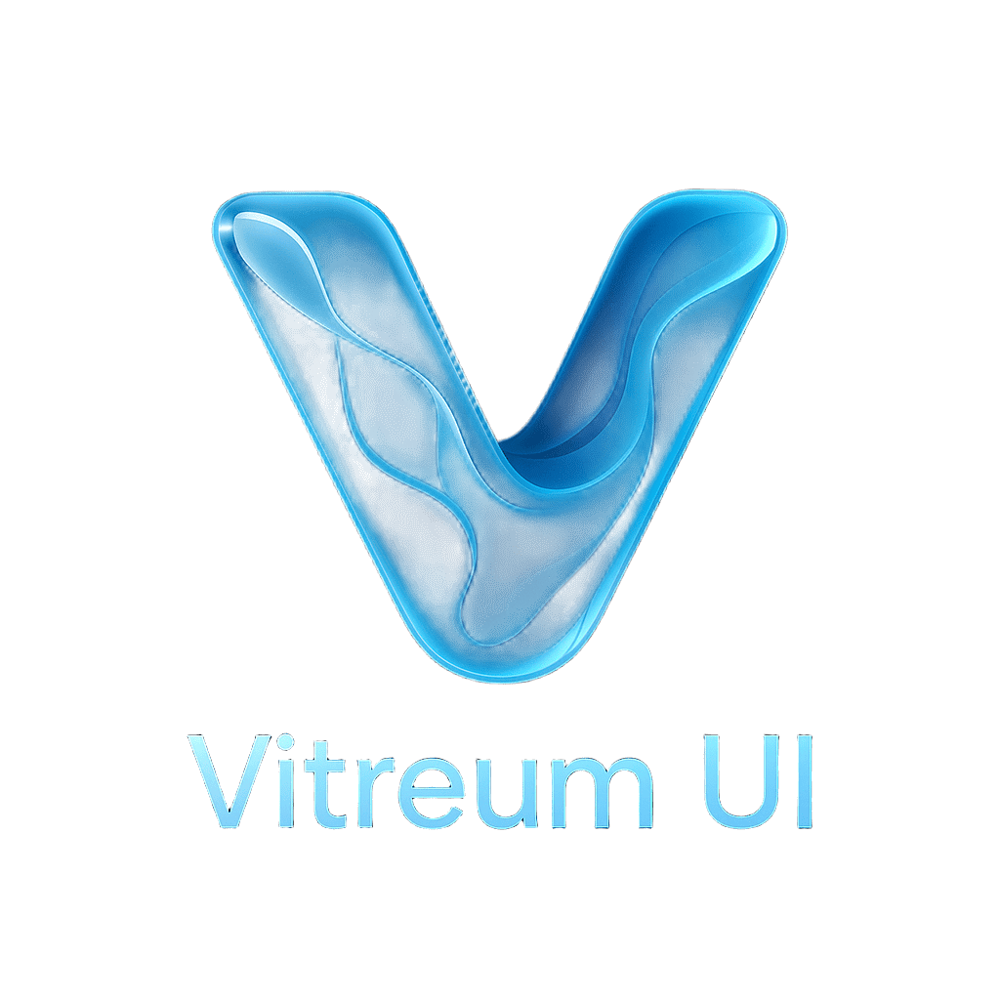

<p align="center">
  
</p>


> **Vitreum UI** —— 一款现代 Web 界面的液态玻璃风格 CSS 库，轻松实现真实玻璃质感、动态光影与流体交互特效。

---

## ✨ 主要特性

- **半透明与折射**  
  多层半透明、玻璃折射和镜面高光，营造真实玻璃材质体验。
- **流体动态与交互**  
  涟漪粒子、动态变形、实时高光动画，响应用户操作，提升沉浸感。
- **环境自适应**  
  智能调整透明度与色彩，适配明暗主题和不同背景。
- **立体悬浮控件**  
  控件采用悬浮设计，并带有微曲投影，增强空间感与视觉层次。
- **GPU/CPU 加速渲染**  
  支持硬件加速，流畅渲染复杂动画与高质量视觉特效。

---

## 🚀 快速上手

1. **安装**

   ```bash
   npm install vitreum-ui
   ```

2. **引入样式**

   ```css
   @import 'vitreum-ui/dist/vitreum-ui.css';
   /* 或在 JS/TS 入口文件中 */
   import 'vitreum-ui/dist/vitreum-ui.css';
   ```

3. **使用类名**

   ```html
   <div class="vt-glass vt-glass--blur vt-glass--highlight">
     <!-- 你的内容 -->
   </div>
   ```

   更多用法详见 [文档](#文档)。

---

## 🧩 设计理念

Vitreum UI 致力于为现代 Web 应用带来高保真、沉浸式的玻璃态界面体验。

- **半透明与折射**：  
  元素呈现真实玻璃材质，支持光线折射和动态高光。
- **流动变形与动画**：  
  控件和界面在交互时可流畅变形，伴随涟漪、粒子等动画反馈。
- **环境感知**：  
  智能适配明暗主题，动态调整色彩、透明度和高光效果。
- **立体悬浮控件**：  
  按钮、滑块等控件采用悬浮式设计，辅以微曲投影增强立体感。

---

## 📚 文档

- [使用指南](docs/usage.md)
- [API 参考](docs/api.md)
- [示例/演示](docs/examples.md)

---

## 🛠️ 参与贡献

欢迎提交 Issue 和 PR！  
请阅读 [贡献指南](CONTRIBUTING.md) 了解如何参与开发。

---

## 📄 许可证

MIT © [PageSecOnd](https://github.com/PageSecOnd/vitreum-ui)
